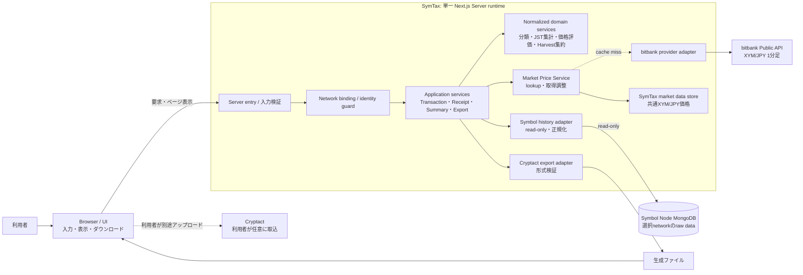

# SymTax 基本設計

## 1. 目的、対象、対象外

### 1.1 目的

本書は、承認済みの [SymTax コンセプト](concept.md) と [要件定義](requirements.md) を満たすため、責務の配置、依存方向、データ所有、trust boundary、主要フロー、失敗時の扱いを定める。Requirementsの内容や初期スコープは変更しない。

初期構成は、Next.js App Routerを用いた単一のWebアプリケーションとする。Browserは表示・利用者操作を担い、Next.js ServerがSymbolデータ参照、正規化、集計、価格評価、Exportの処理主体となる。Node、価格Provider、Cryptact固有仕様との境界をアダプターに隔離する。

### 1.2 初期対象

- Symbol（XYM）のTransactionとReceiptの参照・整理
- それぞれ独立した月サマリー → 日サマリー → 個別明細
- JST（Asia/Tokyo）を基準とする日次・月次集計
- Harvest関連Receiptの個別価格評価とCryptact向け日次集約
- bitbank Public APIのXYM/JPY 1分足の保存・再利用
- Cryptact向け個別明細とHarvest日次集約のExport
- Testnetでの開発・検証、Mainnetを対象とした公開

### 1.3 対象外

初期リリースでは、NEM（XEM）、複数アドレス管理、税額計算、税務判断、申告書作成、ウォレット、秘密鍵・ニーモニック、署名・トランザクション送信、Symbolノード管理を扱わない。TransactionsおよびHarvest以外のReceiptsの日次圧縮も行わない。

Cryptactアカウント連携、Cryptactへの直接送信、異なる価格Provider、Indexerや独立バックグラウンドサービスは初期構成に含めない。

## 2. 上流根拠と用語

### 2.1 設計根拠

| 資料 | この設計での扱い |
|---|---|
| `apps/symtax/docs/concept.md` | プロダクト目的、初期範囲、JST、価格・データ取得原則の上流根拠 |
| `apps/symtax/docs/requirements.md` | 44件のRequirement ID、責任、制約、OPEN項目の規範的根拠 |
| `apps/symtax/docs/reviews/concept/concept-review-001.md` | READY。Conceptを再解釈・再作成しないことを確認 |
| `apps/symtax/docs/reviews/requirements/requirements-review-001.md` | READY。RequirementsのCritical指摘なし。未決事項を後続へ引き継ぐ |
| `docs/knowledge/symbol-openapi3.yml` | Symbol RESTモデル上のTransaction Statement / Receipt用語の参照資料。MongoDBスキーマの正本とは扱わない |
| `_symbol/client/catapult/extensions/mongo/` | repositoryに含まれるCatapult checkoutの実装固有動作を限定確認。プロトコル契約や全ノードバージョン共通のDBスキーマとは扱わない |

`_symbol` は確認時点のcheckout `14a0cc16e` を参照した。そこで見た `MongoBlockStorage.cpp` はBlock保存とStatement保存の異なる経路を、`TransactionStatementMapper.cpp` はStatement内のReceipt表現を、`BlockMapper.cpp` はBlock timestampを別に扱っている。この観察は、Receiptの価格時刻解決をNodeアダプターの責務に閉じる根拠に限る。実運用MongoDBの収録範囲、バージョン差、索引、保持期間を確認した証拠ではない。

bitbankのXYM/JPY・1分足対応およびCryptactカスタムファイル資料はRequirementsに記録された公式資料を引き継ぐ。実応答、過去価格の将来保持、CryptactでのHarvest分類・集約計算はこの設計作業で独立に確認していない。

### 2.2 用語

| 用語 | 意味 |
|---|---|
| Transaction | Symbol上のTransaction履歴。Receiptと独立して取得・表示・集計する |
| Receipt | Transaction Statement等に記録されるReceipt履歴。Transactionと独立して取得・表示・集計する |
| Transaction Statement | Receipt群とそのsource・block height等を関係付けるNode側の記録。上位ドメインではTransactionやReceiptを一体化する理由にしない |
| Normalized record | Symbol Node固有のrawデータをSymTaxの内部責務から分離した、検証済みの履歴表現 |
| Price observation | ProviderからSymTaxが取得・保存した市場価格データの観測記録 |
| Price evaluation | 特定Receiptの数量、block timestamp、採用したPrice observation、価格評価規則を結び付けた派生結果 |
| Incomplete state | 必要な履歴、時刻、価格、または形式変換のいずれかが確認できず、正常完了とみなせない結果状態 |

## 3. システムコンテキストとTrust Boundary

### 3.1 コンテキスト図

Cryptactは生成ファイルを受け取る外部主体であり、SymTaxから直接連携しない。BrowserからSymbol MongoDB、SymTaxの価格Store、bitbankへ直接接続する矢印は存在しない。

### 3.2 Trust boundary

| 境界 | 内外の主体 | 設計上の扱い |
|---|---|---|
| TB-1 | Browser ↔ Next.js Server | Browser入力は未信頼として検証する。Serverは必要な表示・ページ単位の正規化結果だけを返す。DB credential、raw BSON、巨大な全履歴をBrowserへ渡さない |
| TB-2 | Next.js Server ↔ Symbol Node MongoDB | Server側のSymbol adapterだけがアクセスする。read-only権限を前提とし、MongoDBを外部へ公開しない。node identityが期待networkと一致しない、または確認不能なら履歴を返さない |
| TB-3 | Next.js Server ↔ SymTax Data Store | SymTaxのみが所有する価格観測Store。Symbol Node DBとは独立し、共通市場価格以外のユーザー履歴を初期状態で永続化しない |
| TB-4 | Next.js Server ↔ bitbank Public API | 公開価格Providerを外部・失敗し得る依存先として扱う。保存済み価格を優先し、Provider応答を検証・記録する。通信不能を0円や正常評価に変換しない |
| TB-5 | 利用者のExport ↔ Cryptact | SymTaxはファイルを生成するまでを担当する。利用者が内容を確認して別途取り込む。Cryptactの資格情報や口座情報をSymTaxへ渡さない |
| TB-6 | Mainnet runtime ↔ Testnet runtime | それぞれ別の配備先・Node接続・環境設定を用いる。一つのServer runtimeが利用者要求の値だけで両networkを切替える構成を採らない |

### 3.3 Network binding

各runtimeは起動時に一つの期待networkへ結び付く。開発・検証runtimeはTestnet、公開runtimeはMainnetとする。networkは利用者が指定する検索条件ではなく、サーバーの配備境界で選択する。

Network guardは期待networkと、接続先Nodeについて独立に得たNetwork identityを照合する。照合元を環境設定そのものだけに依存させない。identityが不一致または確認不能な場合はfail-closedとし、履歴取得・評価・Exportを開始または継続しない。すでに得た当該要求の結果は破棄し、他networkのキャッシュや派生結果へ読み替えない。

identityの具体的な取得元とNode側の確認契約はOPEN-009としてSpecification / 運用設計で確定する。MainnetとTestnetの接続設定、Node用credential、実行環境は分離する。全chain由来の一時結果・将来追加されるcacheはnetwork identityで隔離する。市場価格観測だけはXYM/JPY市場共通データであり、chain-derived cacheと区別して共有する。

## 4. コンポーネント責務と依存方向

### 4.1 コンポーネント

| コンポーネント / 責務 | 主な責任 | 依存・出力 |
|---|---|---|
| Browser / UI | アドレス・期間・表示カテゴリ・ページ等の利用者入力、サマリー・明細・状態表示、完成したファイルのダウンロード | Next.js Serverとのみ通信。全履歴保持、意味解釈、価格の正本管理を行わない |
| Server Entry | Browser要求の形式・範囲を検証し、適切なApplication serviceへ渡す。出力前に完了・不完全状態を明示する | Browser入力はuntrusted。API pathやresponse shapeはSpecificationへ委譲 |
| Runtime / Network Binding | 配備ごとのnetwork・Node接続・credential参照先を束ね、期待networkと接続Node identityを検証 | 起動時のfail-closed。利用者入力でMainnet/Testnetを横断切替しない |
| Transaction Browse Service | 指定アドレス・期間のTransactionだけを取得し、正規化済みTransactionページとcoverage状態を返す | Symbol History Adapter。Receiptモデルへ統合しない |
| Receipt Browse Service | 指定アドレス・期間のReceiptだけを取得し、Statement・Blockの参照情報を解決してReceiptページを返す | Symbol History Adapter。Transactionモデルへ統合しない |
| Symbol History Adapter | Node固有rawデータの取得、対応schemaの検証、Transaction / Statement / Receipt / Block情報の解釈、正規化、coverage判定 | Symbol Node MongoDBをread-onlyで参照。上位へraw BSONを出さない |
| Transaction Normalizer | Transaction側のNode形式をTransaction domain recordに変換し、未知型・必須情報欠損を明示 | Symbol adapterの内側。具体型分類・項目対応はSpecification |
| Statement / Receipt Normalizer | StatementをReceiptのsource情報として解釈し、Receipt個別モデルとblock時刻解決結果を生成 | Symbol adapterの内側。Receiptに独立timestampを仮定しない |
| Summary Service | TransactionまたはReceiptの片方だけを、JSTの月・日bucketへ集計する | 個別正規化recordをbounded streamで消費。無制限の全件配列を作らない |
| Harvest Classifier | Specificationで定義するReceipt識別条件を適用し、Harvest Receiptとして判定する。非Harvest・未知・判定不能を区別 | 税務判断をしない。分類根拠はdomain結果へ保持 |
| Market Price Service | 実timestampに対応する価格観測を探索し、必要ならProvider取得を調整する | Price Store、bitbank Provider。JSTの集計日を価格時刻として流用しない |
| bitbank Provider Adapter | bitbank Public APIの呼出しとProvider応答の境界、応答異常・欠損の検知 | 市場データだけを扱う。node、address、Receiptの知識を持たない |
| SymTax Price Store | XYM/JPYの共有価格観測と取得provenanceの永続化・再利用 | Symbol Node DBとは別のSymTax Data Store。期間経過のみを理由に消去しない |
| Receipt Valuation Service | 個別ReceiptのXYM数量、Statement由来block timestamp、採用Price observation、価格規則を結ぶ評価結果を作る | Price ServiceとReceipt domain record。欠損・未評価を値0とせず状態として返す |
| Aggregation Eligibility Boundary | 仕様で承認された集約条件に基づき、各Receiptをeligible / ineligible / unknownに分類 | 税務判断そのものを持たない。未決定条件を勝手に許可しない |
| Harvest Aggregation Service | eligibleな個別Harvest Receipt評価から、JST日単位の派生集約と構成Receipt参照を作る | Receipt/valuationの個別recordを保持。Transaction、他Receiptを対象にしない |
| Cryptact Export Adapter | 内部recordをCryptact向け表現へ写像し、形式・対象・完全性を検証する | 内部domainはCryptact列・取引種別に依存しない。具体形式はOPEN-005後のSpecification |
| Export Delivery | 完成した出力をBrowserへ渡す。途中失敗・未検証ファイルを成功として公開しない | 一時stagingのみ。初期リリースでExport履歴をサーバーに保存しない |
| Symbol Node MongoDB | 選択networkのCatapult nodeデータを提供する外部source of truth | Node運用者が所有・保持。SymTaxは書き込まない |
| SymTax Data Store | 取得済み価格観測を共通市場データとして保持する | SymTaxが所有。価格市場データ以外の利用者履歴を初期状態で永続化しない |
| Cryptact | 利用者によるファイル取込後の処理 | 外部責務。SymTaxから直接口座接続しない |

### 4.2 依存方向

依存方向は Browser → Server Entry → Application services → domain services / ports → infrastructure adapters とする。DomainとApplicationはMongoDBドキュメント、Cryptactファイル列、bitbank API responseに依存しない。Symbol adapter、Provider adapter、Export adapterが、それぞれの外部形式を内側の境界で受け持つ。

Transaction BrowseとReceipt Browseは別のApplication責務・domain record・summary経路を持つ。StatementとBlockの技術的関係はReceipt adapterが解決するが、StatementをTransactionの明細配列にまとめてReceiptカテゴリを失わせない。

初期リリースは同一Next.js Server runtimeで動作する論理コンポーネントとし、別サービス、queue、独立APIを導入しない。各外部ポートと責務境界は後にIndexer・background worker等へ移せるが、その分離を初期実装に先取りしない。

## 5. データ所有、正規化、lifecycle

### 5.1 正規化境界

Symbol History Adapterがraw Node表現を読み取り、schema・必要情報・Network identity・Statement/Block参照を確認してSymTax domainへ変換する。この境界より上位のSummary、Valuation、Aggregation、UI、ExportはMongoDB内部schemaやcollection構造を参照しない。

Normalized recordはTransactionとReceiptで型・取得責務・識別子・coverage状態を分ける。Receipt側はStatement由来sourceとBlock由来の実timestamp解決結果を関連付けるが、Receipt自身にtimestampを捏造しない。未対応schema、未知の必須型、参照できないBlock timestampは正常なrecordとして隠さず不完全状態を付与する。

Blockchain数量は整数のnative unitで扱い、数量変換・集計にbinary floating pointを使わない。JPY評価を含む価格算術もbinary floating pointに依存しない。小数精度、評価時の丸め順序・桁数はSpecificationで定める。

### 5.2 データ所有・保持方針

| データ | Source of truth / owner | 永続化 | 再生成・失敗上の扱い |
|---|---|---|---|
| Symbol raw Transaction | 確定Transactionの規範的sourceは対象Symbol network。SymTaxの参照元は当該networkのNode MongoDB / Node運用者 | Node側に保持。SymTaxはコピー・更新しない | 指定期間を読み直してNormalized Transactionを生成。Node保持不足・Node viewの不整合は不完全状態 |
| Symbol raw Receipt / Statement | 確定チェーンに対応するNodeのStatement view / Node運用者 | Node側に保持。SymTaxはコピー・更新しない | Receiptを独立に読み直す。Statementはsource/block時刻解決用の関係情報として使う。Node viewの完全性を独立保証とはしない |
| Block / timestamp | 対象networkのSymbol chainに対応するNode view / Node運用者 | Node側に保持。SymTaxは書き込まない | Receiptの実timestamp解決に使う。取得不足はprice evaluation不能状態へ伝播 |
| Normalized Transaction | 原sourceはSymbol Node。正規化結果はSymTax domainのrequest-local値 | 初期は永続化しない | Node履歴から再生成。Node側sourceが不足・変更なら完全性を示す |
| Normalized Receipt / Harvest Receipt | 原sourceはSymbol Node。正規化結果はSymTax domainのrequest-local値 | 初期は永続化しない | Node履歴から再生成。Price/Harvestに関する根拠状態を保持した一時結果 |
| Price candle observation | 原観測providerはbitbank。取得済み観測の保存上の正本はSymTax Price Store / SymTax | **永続化する。アドレス非依存のXYM/JPY共通データ。期間経過だけで削除しない** | Provider停止時も既存観測を利用可能。再取得・訂正値は既存観測を上書きせず、新しい観測として追記 |
| Receipt price evaluation | Receipt + block timestamp + Price observation + 評価規則から導くSymTax派生値 | 初期はユーザー別履歴として独立永続化しない。閲覧・Export処理中に根拠付き評価結果を保持 | 保存価格・Symbol sourceから再生成する。元source未取得、規則・価格選択未確定なら未評価/不完全。評価処理中は採用観測の参照を保持 |
| 月次・日次サマリー | 個別Normalized履歴から導くSymTax派生値 | 永続化しない | 指定範囲を再走査し、JST境界で再生成する |
| Harvest aggregation result | 個別Harvest Receipt評価から導くSymTax派生値 | 永続化しない | eligibleな個別結果から再生成。結果の各行は処理中に構成Receipt参照を保持 |
| Export artifact | Export Adapterが生成。受渡し後は利用者が所有 | SymTaxサーバーにはアーカイブしない。生成中のみ一時staging | 完成・検証後にBrowserへ渡す。失敗/再起動時は一時物を破棄し、sourceから再生成 |
| User search condition | Browserから受け取る利用者入力 | 初期はサーバー側に検索履歴として永続保存しない。処理中のrequest scopeのみ | 利用者が再入力して再実行。URL等で共有する場合のprivacy契約はSpecificationで扱う |
| Operational log / metrics | SymTax運営 | 価格市場データと分離。ユーザー履歴を含む長期ログ保存はしない | credential、connection string、raw全文、不要なaddressや円評価の記録を避ける。具体保持期間はOPEN-010 |

Receipt evaluationを独立永続化しない判断は、Requirementsが初期リリースで利用者ごとの履歴保存を要求していないことと、OPEN-010のdata-retention判断を先取りしないことによる。価格観測は全利用者共通で再利用できるSource dataとして保存し、選択された価格と評価根拠は各処理結果に結び付ける。同じ市場時刻の初回有効観測を既存の標準観測として固定し、後からProviderが返す異なる値は訂正候補として別に追記する。訂正候補を自動で標準化・適用せず、明示された再評価手順が確定するまで既存評価根拠の観測参照を変更しない。これによりRetry・再表示が過去価格を黙って切り替えない。訂正候補の採否・再評価条件はOPEN-004としてSpecification / 運用判断に残す。

### 5.3 Symbol MongoDB境界とschema変更

Symbol Node MongoDBは、Network-bound runtime内のSymbol History Adapterからだけ参照する。read-only資格情報・読取責務を境界条件とし、SymTax Data StoreやApplication serviceからNode DBへ直接接続させない。DB書込み・index変更・node管理はSymTaxの責任に含めない。

AdapterはNode固有表現、binary/value encoding、Transaction / Statement / Receipt / Block間の対応を解釈する唯一の層とする。内部へ渡すのは正規化した必要項目とsource reference、coverage stateだけである。Node schemaの更新ではAdapterの互換性判定と正規化写像を点検し、Summary・UI・Cryptact Adapterまで影響を広げない。

Adapterが未対応schema、必要履歴の不足、ReceiptからStatementまたはBlock timestampへの解決不能、Network不一致を検出した場合は、明示的なincomplete resultとしてApplicationへ伝える。失敗を空配列・0値・成功扱いへ変換しない。REST APIはMongoDBで扱えない必要情報の補完・独立検証に限り、全履歴取得の主経路にはしない。API利用範囲と整合確認契約はSpecificationで定める。

実運用Mainnet/Testnet nodeへの接続、対象version、保存履歴、要求したaddress・期間を網羅できるかは本作業で確認していない。Design受入れ前の成立性確認事項としてOPEN-007に残す。

## 6. 主要フロー、失敗、Atomicity、Retry

### 6.1 時刻と集計境界

時間処理は二つの入力概念を分ける。

1. **集計calendar date:** DomainのJST Calendar Boundary serviceが、瞬時刻をJSTの月・日bucketへ割り当てる。境界はJST 00:00以上、翌日00:00未満。
2. **市場価格lookup instant:** Receiptを含むStatementのBlockから解決された実timestampをそのままPrice serviceへ渡す。JST日付やbitbank APIの取得日keyに置き換えない。

Symbol時刻の解釈とblock timestamp取得はSymbol adapter、集計calendarへの変換は共通domain boundary、bitbank endpointの日付keyや価格足timestampの読み替えはProvider adapterの責務とする。どのOHLC値・価格足を選択するかは価格評価Specificationが決める。Provider側の区切りは、JSTのSummary/Harvest日境界のsource of truthではない。

### 6.2 主要フロー

| # / フロー | 主体・データの流れ | 完了条件 | 失敗時・再試行・原履歴 |
|---|---|---|---|
| 1. Transaction閲覧 | Browserがaddress・期間・Transactionカテゴリを送る → Entryが検証 → Network guard → Transaction Browse → Symbol adapterが範囲付きで取得・正規化 → Browserへページとcoverageを返す | 指定Networkと範囲のTransactionだけを独立表示 | invalid inputは再要求。Mongo障害/schema不明/保持不足はincompleteとして表示し、空履歴と偽装しない。安全な読取要求は同条件で再試行可能。raw sourceは変更しない |
| 2. Receipt閲覧 | BrowserがReceiptカテゴリを指定 → Receipt Browse → Statement / Receipt adapterがReceiptとStatement sourceを正規化し、Block timestamp参照状態を付ける | Receipt独立一覧と各記録の識別・coverageが得られる | StatementやBlock参照不能・未知Receipt typeを明示。Transaction一覧へ統合しない。読み取りは再試行可能で原履歴を保持 |
| 3. 月 → 日 → 個別 | Browse serviceは範囲を限定してページ読取。Summary serviceはTransactionまたはReceipt片方のrecordをbounded streamでJST bucketへ集計。明細要求は対象日・ページだけを読取 | Summaryからその構成recordに遷移でき、JST bucketの件数等を確認できる | bucketのsourceに欠落がある場合はその範囲をcomplete表示しない。再計算は原sourceから可能。大きな全件arrayやDOMを作らない |
| 4. 保存価格によるReceipt評価 | Receipt + Statement由来block timestamp → Price Serviceが共通Price Storeを検索 → Valuation Serviceが採用観測と評価を関連付ける | 個別receiptの数量、timestamp、Provider、granularity、採用観測、結果を根拠と共に確認できる | 時刻未解決または適合価格なしはunvalued/incomplete。0円にしない。履歴は再照会・再評価可能 |
| 5. bitbankからのmiss取得 | Price Serviceが不足範囲だけProvider Adapterへ依頼 → response検証 → 有効なobservationsをPrice Storeへ追記 → 評価へ戻す | 必要データが取得・保存済みで、根拠が指せる | Provider失敗・部分応答なら取得済み有効分はcacheへ残せるが、要求全体は不完全。再試行は未取得範囲を対象とし既存observationsを上書きしない |
| 6. 価格取得不能 | Provider Adapter / Storeが保存済みdataと未取得範囲を区別 → Price Serviceがmissing stateをValuation・Summary・UI/Exportへ伝える | 保存価格だけで必要評価が成立した範囲のみcomplete | 保存価格のhitはProvider停止中も利用可能。missを価格0や正常値へ変換しない。補間・近傍探索はSpecification承認前に行わない |
| 7. Cryptact個別明細 | Export serviceが指定カテゴリ/範囲を読み、Normalizer・必要な価格評価結果を統合 → Cryptact Adapterが出力対象を検証・変換 → Deliveryが完了ファイルをBrowserへ渡す | 全対象が取得済みで形式検証に通った出力のみdownload可能 | 途中source欠損、未対応分類、変換不能なら完全な成果物として公開しない。再実行はsource・保存価格から作り直し、node/price provenanceを破壊しない |
| 8. Harvest日次集約 | Receipt serviceがHarvest候補を読む → 個別価格評価 → Eligibility boundary → JST日bucketごとにHarvest Aggregation → Cryptact Adapter | eligibleな同種記録を要件・仕様に従い集約し、行と構成Receipt群を処理結果中で追跡できる | Harvest以外、unknown、unvalued、ineligibleを暗黙に混ぜない。該当bucketは集約artifactをcompleteとして出さず、理由を示す。利用者が個別明細出力を選べる |
| 9. 集約不可・判定不能 | Eligibility boundaryが規則未確定、記録差異、必要価格不足等を検出 → Applicationがbucket状態を集約結果へ伝播 | 対象Receiptごとのeligible / ineligible / unknown状態が区別される | unknownをeligibleと見做さない。自動的な税務判断や別の集約条件を作らない。個別出力は形式適合・完全性を個別に評価し、利用者が選択できる |
| 10. Symbol履歴が不完全 | Symbol adapterがNode query範囲・schema・Statement/Block解決のcoverageをApplicationへ返す | 完全な場合だけcomplete。partial/unsupportedは原因区分付きで表示・伝播 | Summaryは部分値をcomplete totalとして見せない。Cryptact exportは不完全範囲を完全な出力として公開しない。復旧後は同範囲を安全に読み直す |
| 11. Network不一致 | Runtime guardがconfigured expected networkとNode identityを照合してからApplication requestを許可 | identity確認済みの一つのNetworkに限る | mismatch/unknown時はfail-closed。処理を停止し、得かけた結果を返さず、別Network cacheへfallbackしない。構成是正後に新規要求で再試行 |
| 12. Summary / price / aggregation再表示 | 利用者が同条件を再指定 → chain dataはnodeから再読取、priceは保管済みobservationsを再利用、派生値は同じ仕様policyで再生成 | 原sourceと採用価格根拠から確認・再現可能 | Node sourceの保持不足ならincompleteを示す。過去observationsの更新があっても過去の採用根拠を黙って差替えない |

### 6.3 Incomplete stateの伝播

不完全状態の検出責任は次のとおりとする。

| 検出元 | 状態の例 | 伝播先と扱い |
|---|---|---|
| Network guard | Network identity不一致・不明 | requestを停止。結果を構築せず、全後続componentへ進ませない |
| Symbol adapter | history unavailable、保持不足、未対応schema、Receipt/Statement/Block link欠損 | Browse / Summary / Valuation / Exportへcoverage状態を渡す。部分値を全量と表示しない |
| Price Provider / Store | 接続不可、必要足なし、破損・曖昧な価格観測 | Valuationへunpriced/ambiguousを渡す。値0や推測補間にしない |
| Harvest classifier / eligibility boundary | Harvest識別不能、集約条件不明・不適合 | Aggregationへunknown/ineligibleを返す。Harvest以外を圧縮しない |
| Cryptact Adapter | 未対応表現、形式検証失敗 | Exportをreadyにせず、生成ファイルを公開しない。内部履歴を壊さない |
| Export Delivery | staging・出力失敗 | 完了artifactを返さず一時出力を破棄。再生成可能な状態にする |

全段で同一の汎用空配列・0値・成功flagへ縮退させない。Specific status vocabulary、UI message、error codeはSpecificationで定める。表示可能な部分データがある場合も、completeとincompleteの区別と対象範囲を一緒に保持する。

### 6.4 Atomicity・Retry・再起動

- **Symbol read:** Node DBはread-onlyであり、問い合わせに副作用を持たせない。同じaddress・期間・networkの再実行はsource状態が同じなら再現可能。複数pageの途中で失敗した結果は全期間completeと宣言しない。
- **Price acquisition:** 価格観測は個々の有効単位で永続化できる。取得batchに欠損が残る間は当該要求の完了状態を未完了とする。有効部分はcacheとして再利用可能。Retryで同じ観測が重なる場合は同一事実を重複・矛盾させず、Provider訂正らしい違いは新観測として隔離する。Conflict選択規則はSpecification / 運用判断へ残す。
- **Receipt valuation:** 個別評価はrequest-scopedかつ再生成可能とする。元Receipt、block timestamp、採用観測への参照のいずれかが確定しない評価を確定値扱いしない。
- **Harvest aggregation:** 集約は入力Receiptに対する派生処理であり原Receiptを更新・削除しない。groupがcompleteかつeligibleと確認されるまで集約行をcompleteにしない。途中終了時は集約を再生成する。
- **Export:** ファイルは一時stagingへ順次生成する。全対象範囲のcoverage、価格条件、eligibility、Cryptact形式検証が完了してからdownload可能状態にする。途中失敗やprocess再起動後の一時artifactは利用者へ完成品として返さず、削除して再生成する。具体staging方式や上限はImplementation / 運用設計。
- **SymTax store restart:** 永続市場価格observationsを起動後も参照可能にする。価格Storeが利用不能ならキャッシュ未取得分を取得済みと誤認せず、必要範囲の価格評価・出力を止める。

## 7. Symbol / NEM、Mainnet / Testnet、Browser / Serverの境界

- **Symbol / NEM:** 初期DomainとadapterはSymbol専用とする。NEM共通モデル・処理への暗黙統合をしない。将来対応時は独立したchain adapterとchain固有正規化を設計する。
- **Transaction / Receipt:** 独立した取得service、Normalized model、summary、表示カテゴリを保つ。技術関連参照が必要ならreceipt sideの関連情報として表現し、共通eventへflattenしない。関連表示を初期要件へ追加しない。
- **Mainnet / Testnet:** 開発・検証と公開用途のruntimeを分け、一つのruntimeに一つのnetwork identityを割当てる。期待値と観測identityを比較して不一致・不明を拒否する。市場価格Storeだけはnetwork非依存の市場データとして共有可能である。
- **Browser / Server:** Browserはquery・paging等のUI操作と表示のみ。MongoDB、DB credential、Provider API key等（初期価格APIはPublic）、価格正本、全件処理を持たない。全履歴を一括転送せず、明細ページや集計結果をServerから段階的に受ける。
- **Symbol node / SymTax:** Node DBは外部chain sourceでread-only。SymTaxのmarket dataをNode DBへ書かず、ユーザー履歴をNode DBへ保存しない。別StoreはSymTax所有でNode DBと分離。
- **Protocol / Catapult implementation:** SymbolのREST/OpenAPIやprotocol用語と、当該Catapult実装のMongoDB document構造を同一視しない。MongoDB mapperへの依存はSymbol adapterに閉じる。

## 8. 運用前提、性能、検証方針

### 8.1 運用前提

- 各環境は稼働する対象networkのSymbol Node MongoDBへサーバー側からのみ到達可能で、read-only接続を与える。
- Node運用者は接続可能性だけでなく、要求期間の履歴保持・schema version・Block timestamp参照可能性を公開前に確認する。SymTaxはNode DB管理を担わない。
- SymTax Data StoreはSymbol Node DBと別のアクセス境界・保管先を持ち、market price observationの継続保存を可能にする。価格データは市場全体で増加し得るため、容量監視・バックアップ・Store可用性の運用責任を別途定める。価格を期間経過のみで削除する運用はしない。
- bitbankは不安定になり得る外部Providerとして扱い、過去価格取得を利用時の同期成功に依存させない。価格Storeが利用不能な場合の挙動は保存済みデータ有無に応じてfail-safeとする。
- 初期アプリは単一Next.js Server構成。Node読取・価格取得・評価・exportは同一アプリケーション内の責務として構成し、独立workerやqueueを初期要件化しない。
- Logsは操作の内部診断に必要な範囲に限り、DB credential、connection string、raw全文、不要なaddress、Harvest数量、円評価を記録しない。正確な保持期間、利用者説明、運用担当範囲はOPEN-010。

### 8.2 性能設計

PERF-001〜004を満たすため、次の構造を採用する。

- Transaction / ReceiptのQuery Serviceが、アドレス・指定期間を下位Symbol adapterへ条件として渡す。指定外の全期間を先に取得して上位でfilterする設計は採用しない。
- Raw documentを一件ずつまたはbounded chunkで正規化し、上位へ必要なfieldだけを渡す。Cursor/pageの具体サイズはSpecification / Implementationで定める。
- 明細はpage/chunk単位で取得し、Browserは現在表示する範囲を保持する。全履歴の一括送信・一括parse・全件DOM描画を前提にしない。
- 月・日summaryはstreaming aggregationとし、全個別明細を配列へ蓄積しない。状態メモリは対象期間の日/月bucketと限定された処理windowを中心に抑える。
- Harvest price evaluationは要求timestampの範囲をまとめてPrice Storeから解決し、過去価格の再取得を避ける。Providerへの粒度別呼出しやbatch contractはSpecificationで定める。
- Exportは各pageを処理し、一時stagingへ逐次生成する。全件をbrowserへ送ってCSV変換する方式を採用しない。
- DB cursor、Provider response、normalizer、aggregation、export間でbounded backpressureを持ち、無制限の中間配列を作らない。個々のpage size、同時実行数、最大期間はSpecification / Design validationで決定する。

OPEN-008の評価では、数年分のTransactions、月数百〜数千件規模のReceipt、月700件程度のHarvest Receiptを含む代表データを用いる。公開前に実利用条件で応答時間・メモリ・Store容量の目標を計測して合意する。上流に根拠がない秒数・byte上限は本書で作らない。

### 8.3 検証方針

- **Source compatibility:** Testnet nodeで現行対応対象のraw履歴、Statement→Block時刻解決、schema識別と要求期間の完全性を確認する。実node version・履歴保持範囲を記録する。
- **Boundary:** BrowserがDBへ到達できないこと、ServerのNodeアクセスがread-onlyであること、expected/observed network mismatch・identity unknownがfail-closedとなることを外部境界で確認する。
- **Domain consistency:** TransactionとReceiptの一覧・summaryの独立性、JST月日境界、サマリーから個別recordへの追跡、派生処理後に原sourceが変更されないことを検証する。
- **Price reproducibility:** 保存済み価格をProvider停止時に再利用できること、価格観測のprovenanceとReceipt valuationとの対応、欠損を0値へ変えないことを検証する。OHLC・欠損fallbackはSpecification承認後の規則に照らす。
- **Export / aggregation:** 個別行とHarvest日次集約を分離し、aggregation rowから構成Receipt・各valuationへたどれること、non-Harvest/unknown/incompleteを黙って集約しないことを確認する。Cryptact側の計算同等性を税務正解として扱わない。
- **Scale:** §8.2の代表条件と、後に合意した実行環境・定量目標を用いて、全期間取得・ブラウザ一括保持に退行していないことを評価する。

この節は検証責任の境界を示す。具体fixture、試験コード、性能の数値閾値、CI commandはSpecification / Implementation計画へ残す。

## 9. 採用した設計判断と代替案

各判断はRequirements、確定済み制約、Repository内Catapult実装確認の範囲に基づく。新しい外部可視機能を導入しない。

| ID / 選択肢 | 採用案 | 採用理由 | 棄却理由 | 影響Requirement ID | 見直し条件 |
|---|---|---|---|---|---|
| DD-001 Browser中心処理 vs Server中心処理 | Server中心。Browserは入力・表示・download | MongoDBをサーバー側だけで参照し、期間filter、正規化、summary、valuation、exportを一箇所のtrust boundary内で行える | Browser全件取得・解析はPERFとDB credential境界に反する | CON-002、FUNC-001、PERF-001〜004、SEC-002 | 長期履歴でServer負荷が不適合と計測され、承認済み別processが必要になった場合 |
| DD-002 Raw documentを上位へ渡す vs normalization boundary | Symbol adapterにRaw→Normalized境界を置く | 当該Catapult mapperとnode schema変更を外側へ閉じ、UI・Summary・ExportのSymbol DB依存を防ぐ | Raw document共有はschema変更が全componentへ伝播し、必要以上のdata露出・転送を招く | FUNC-001〜008、DATA-001〜002、EXT-003 | Raw mapping維持コストや対象Node versionが変わったとき。境界自体は維持する |
| DD-003 価格を毎回bitbankから取得 vs SymTax共通Price Store | 有効な過去価格observationsをSymTax側へ永続保存し再利用 | Providerの保持期間・可用性に依存せず、同一市場価格を複数addressで再利用できる | 毎回取得はAPI障害、歴史保持の変化、繰返し通信に依存する | CON-005、PRICE-001、PRICE-003、EXT-001 | Providerが長期保存機能を公式に保証し、保持・再現性の前提が変わる場合 |
| DD-004 Node DBに価格を置く vs SymTax Data Store | 価格をSymbol Node DBと分離したSymTax所有Storeへ保存 | Node DBは外部source/read-onlyの責務を維持。市場価格はaddress/node/networkに依存しない | Node DBへの書込みはSEC-002/004と運用責任境界に反する | CON-003、CON-005、SEC-004、PRICE-003 | Node所有・運用境界に承認済み変更がある場合。ただしSymTax固有データ分離要件に従う |
| DD-005 Transaction / Receipt統合モデル vs 独立モデル | 別reader・domain・summary経路。関連付けはoptionally receipt側参照 | 利用者が独立参照・集計する要件を保ち、Statementの技術関係もadapter内部で解決できる | 単一履歴flattenは、取得・表示・集計・出力の意味を混在させる | FUNC-002〜009、EXPORT-003 | Requirements変更なしでは見直さない。関連表示要否のみOPEN-006で仕様化 |
| DD-006 Cryptact形式をdomainへ持込 vs Export Adapter分離 | Cryptact Export Adapterと出力検証境界で外部形式へ変換 | 外部形式改訂やHarvest分類未確定の影響を、Symbol domainやNode adapterへ波及させない | DomainにCSV列・取引種別を置くとOPEN-005を先取りし、Provider/chain責務が結合する | EXPORT-001〜007、EXT-002 | Cryptactが安定した公式schema/APIを提供し、別の承認済み設計が採用された場合 |
| DD-007 Runtime network parameter切替 vs 強い環境分離 | 1つのserver runtime・配備を1 networkへ束縛し、identityをfail-closed照合 | Testnet/MainnetのDB・data・派生値誤混合と、request-controlled network injectionを避ける | 同一runtimeの自由切替は環境・cache・resultの分離確認を複雑にし、誤設定影響を拡げる | CON-004、FUNC-001、SEC-003 | 運用要件が複数network同時提供を承認した場合に、別設計を実施 |
| DD-008 Single Next.js app vs initial distributed services | UI、Application、domain processingを同一Next.js Server内の論理境界とする | 初期スコープで操作・運用面を抑えながら将来分離可能なportを設けられる | queue / worker / APIサービスを初期導入する根拠がなく、不要な運用境界を増やす | CON-007、PERF-001〜004 | 性能計測や価格取得頻度が同一runtimeで要件を満たせないと実証された場合 |
| DD-009 ユーザー履歴/検索/評価を永続保存 vs request-local | 初期はユーザー検索条件、chain history、valuation、summary、aggregation、exportをサーバー永続化しない | Privacy/retention未決の状態でアドレスと行動・資産量を蓄積せず、price dataのみを共通市場情報として再利用できる | すべてを永続化する案はOPEN-010の判断・保存責任を先取りし、不要な活動情報の保管につながる | DATA-001〜003、PRICE-003、PRIV-001 | 利用者別の再開・履歴管理が承認済み要件へ加わり、保持期間・削除責任が決まった場合 |
| DD-010 Price record更新時にin-place overwrite vs append-only observation | 取得済み観測を不変にし、異なる再取得値は別観測として追記。選択済み評価は観測参照で固定 | 取得済み価格・既存valuation provenanceをProvider訂正・再試行で黙って変えない | In-place updateは過去の価格評価やCryptact出力を同じ根拠で再現できなくする | CON-005、PRICE-003〜004、EXT-001 | OPEN-004でProvider訂正の承認・選択規則が定まり、移行可能な履歴版管理が設計された場合 |

DD-009はrequest-local評価結果を失った後の再表示をNode sourceと保存価格から再計算する選択である。Nodeが古いsourceを保持していない場合は再計算可能性を保証できず、不完全とする。永続評価履歴やuser accountを無断で追加しない。

## 10. 未決定事項とOPEN-001〜010の扱い

「Designで決定」は責務や依存境界が決定した意味であり、具体的なwire format・schema・税務上の解釈を決定したものではない。

| OPEN | Designで決定 / 部分解決した事項 | Specification・外部確認・運用へ残す事項 | 状態 | 関連Requirement ID |
|---|---|---|---|---|
| OPEN-001 税務方式とHarvest集約境界 | Eligibility boundaryを独立させ、集約規則を外部仕様として受取り、unknown/ineligibleを許可しない。必要時にindividual exportへ切替可能な責務を置く。Aggregation componentに税務判断を持たせない | 総平均法・移動平均法、同日売却等との順序、どの組合せを同等とみなすかは税務確認・Specification。SymTaxが正解を決めない | 部分解決 | EXPORT-004〜006、PRICE-004、DATA-001 |
| OPEN-002 Statement block timestampから価格足への対応 | Receipt時刻はReceipt側に作らず、Symbol adapterがStatementのheightとBlock timestamp解決を担い、価格serviceへ実instantを渡す。JST date bucketと別経路にする | 1分足を選ぶ境界、OHLC値、時刻精度・足timestampの照合規則 | 部分解決 | PRICE-002、PRICE-004 |
| OPEN-003 zero-volume / missing price | Price stateにavailable / missing / ambiguous / provider unavailable等の意味状態を作り、値0と区別する。欠損は上位へ伝播する | zero-volume candleの採否、足なし・古いReceiptのfallback、価格評価・Export可能条件 | 部分解決 | PRICE-005、DATA-002、QUAL-001 |
| OPEN-004 更新・再取得・Provider停止 | 過去観測を永続・再利用し、age-based deletionなし。既存値はin-place上書きせずappend-onlyで新観測を記録。保存済値はProvider停止中も参照する | Provider訂正候補の採用・優先順位、再取得契機、明示的再評価、運用上のrepair手順・保存容量対応 | 部分解決 | PRICE-003〜005、EXT-001 |
| OPEN-005 Cryptact互換・Harvest表現 | Domain/aggregationとCryptact形式をAdapterで分離。出力前の適格性・形式検証を独立責務化する | 現行受入形式と実取込、Harvest種別・値、日次集約行の計算受入・個別との同等性 | 外部確認 / Specificationへ残す | EXPORT-001〜007、EXT-002 |
| OPEN-006 Transaction/Receipt関連付け | 内部Transaction/Receiptモデル・取得・summaryは独立。初期要件にない関連表示は必須化せず、採る場合も独立カテゴリを保つ | 関連表示の必要性と範囲は後続UI / Specification。Statement/Blockのデータ関係を内部で使うのは可 | Design解決（独立性と非必須を確定） | FUNC-002、FUNC-009 |
| OPEN-007 Node Mongo schema・履歴保持・version | Node DB access、Mongo構造解釈、正規化、coverage判定をSymbol adapterへ隔離。unsupported schema/source gapはincomplete。実ノード適合確認を公開前gateとする | 対象node software version、実Mainnet/Testnetのcollection/document・履歴網羅性・保持可否。Nodeの実データは確認していない | 部分解決 / 実環境検証へ | CON-001〜003、FUNC-001〜004、DATA-002、EXT-003 |
| OPEN-008 性能数値 | bounded streaming、指定範囲query、page/chunk表示、summary bounded state、price reuse、server-side export stagingを採用。代表条件をvalidationに指定 | 具体応答・memory・容量の閾値、計測端末/環境、実測の合否値 | 部分解決 / 実測後決定 | PERF-001〜004、QUAL-001 |
| OPEN-009 network誤接続 | 1 runtime / deployment = 1 expected network、Node identityを独立検証、unknown/mismatchはfail-closed、chain-derived dataはnetwork隔離、market priceは明示的にnetwork非依存とする | Node identityを独立に得る具体 source、設定供給方法・本番配備確認の運用。ローカルCatapult sourceのみでは実運用identity確認方式を確定できない | Architecture解決 / identity evidence運用へ残す | CON-004、FUNC-001、SEC-003 |
| OPEN-010 retention・logs・privacy | search condition/raw chain data/valuation/summary/aggregation/exportを初期サーバーで永続保存せず、価格だけを市場共通dataとして持つ。ログにcredential・raw全文・不要なaddress/activity内容を入れない | log/temporary stagingの具体保持期間、利用者Privacy説明、運用上のアクセス・削除責任 | 部分解決 / 運用Privacy判断へ | DATA-003、PRIV-001、PRICE-003 |

## 11. Specificationへの引継ぎ

Specificationは、設計済みの責務境界を保った上で、以下を外部契約・domain規則として定める。ここで候補に挙げても、本書では確定していない。

### 11.1 Symbol履歴・正規化

- Transaction TypeとReceipt Typeの初期対応範囲
- Harvest Receipt識別条件と分類根拠
- raw Symbol dataからNormalized Transaction / Receipt / Statement / Block参照への項目対応
- Statement sourceとBlock timestampの取得・不一致・欠損ルール
- page / chunk contract、重複・境界・complete coverageの表現
- 未知型、未対応schema、履歴保持不足の外部表示・出力上の制約
- Symbol REST APIによる補完が必要な情報と、MongoDBとの整合確認規則

### 11.2 時刻・価格

- Network/nodeからtimestamp値を読み取り、実instantへ解釈する規則
- JST day/month calendar変換と境界条件
- bitbank API側日付key / 1分足timestampと実instantを対応させる規則
- OHLC採用値、zero-volume足、足欠損、近傍探索や補間を採用するか
- Receipt price evaluationのprovenance項目と使用観測の参照形式
- provider response不正、partial range、provider訂正観測の適用・再評価条件
- 数量・円評価の精度、丸め・桁処理

### 11.3 Summary・Aggregation・Export

- Transaction / Receiptごとの集計表示値、数量区分、fee / harvest fields
- Harvest識別後のaggregation eligible条件、税務上の分類の扱い、unknown/ineligibleの区別
- JST日内でのaggregation partition、同日売却等の境界と個別順序の扱い
- aggregated resultの構成Receipt reference contract
- Cryptact CSV/XLSXの実際の対応format、取引種別、field mapping、validation
- 形式未適合、価格未評価、部分取得、集約不可時のexport refusal / partial state
- outputの文字コード・改行・端数等、外部から観測されるfile contract

### 11.4 Browser / Security / Network

- Browserから指定できる入力・検索期間のvalidation、page操作と結果状態のUI契約
- incomplete/unsupported/network mismatch/price unavailableの表示語・操作可能性
- expected / observed Network identityを証明するsource contractと不一致応答
- logからの除外対象、公開情報の取扱いに関する利用者向け説明
- export downloadの完了・再試行契約

この一覧はMongoDB query・collection名・index、API endpoint、React component、class / module、具体的CSV列やOHLCアルゴリズムをDesignで固定するものではない。

## 12. Traceability

以下でRequirementsの44 IDをすべて扱う。Requirement群を同じ責務へまとめる場合は範囲表記し、各IDを追跡可能にする。

| Requirement ID | Design component / Design decision | Specificationへの引継ぎ |
|---|---|---|
| CON-001 | Symbol History Adapter、Node運用者責任、DD-002 | Node version / history coverage / compatible schema (OPEN-007) |
| CON-002 | Runtime Network Binding、Symbol adapter read-only trust boundary | 接続identityとアクセス責任の外部確認 (OPEN-007、009) |
| CON-003 | SymTax Data StoreをNode DBから分離、DD-004 | Data ownership境界 (Symbol側schemaは設計対象外) |
| CON-004 | 1 runtime / deployment = 1 network、Network guard、DD-007 | identity proofとruntime identity表現 (OPEN-009) |
| CON-005 | 共通Price Store、bitbank Adapter、append-only観測、DD-003/004/010 | API足範囲、保存観測のprovenance/重複判定、訂正規則 (OPEN-004) |
| CON-006 | JST Calendar Boundaryと実instant Price Lookupを分離 | Timestamp解釈・日境界・足対応契約 (OPEN-002) |
| CON-007 | 単一Next.js Server内の論理境界、DD-008 | Server entry / payload外部契約。内部分割はImplementation |
| FUNC-001 | Entry validation、Network guard、Transaction/Receipt Browse services | Input format、period/page/complete contract、Network result (OPEN-007/009) |
| FUNC-002 | 独立 Browse service / Normalized model、DD-005 | 独立カテゴリの検索・表示契約 |
| FUNC-003 | Transaction Normalizer | 初期Transaction Typeと表示field |
| FUNC-004 | Statement/Receipt Normalizer | Receipt TypeとHarvest分類 (OPEN-007) |
| FUNC-005 | Summary Service、独立Category flow | Month → day → detailのnavigation contract |
| FUNC-006 | JST Calendar Boundary | タイムゾーン変換規則・境界のSpecification |
| FUNC-007 | Category-specific Summary Service | 表示値・数量/fee aggregation contract |
| FUNC-008 | Normalized source references、request-scoped details | Summary-resultからdetail/sourceの参照契約 |
| FUNC-009 | Optional relationship read modelの境界、DD-005 | 関連表示の要否・必要時の契約 (OPEN-006) |
| EXPORT-001 | Export Application service、Cryptact Adapter | Mode selectionとoutput result contract |
| EXPORT-002 | Individual Export path | 個別取引種別・価格・fee mapping |
| EXPORT-003 | Harvest Aggregation Serviceのscope guard | Harvest-only eligibility contract |
| EXPORT-004 | JST aggregation boundary、Eligibility boundary | Partition/eligible条件・売却境界 (OPEN-001) |
| EXPORT-005 | Aggregation resultにcomponent Receipt references | 各集約行の構成元を確認するcontract |
| EXPORT-006 | Receipt Valuation + Aggregation + provenance | 差異の示し方・評価根拠・価格選択 (OPEN-001/002/005) |
| EXPORT-007 | Cryptact Export Adapter + format validator | 現行Cryptact file acceptance / Harvest representation (OPEN-005) |
| PRICE-001 | bitbank Provider Adapter + Market Price Service | pair・1分足の外部response semantics |
| PRICE-002 | Receipt/Block time normalizer→Price Lookup instant | timestampから足を選ぶ規則、OHLC (OPEN-002) |
| PRICE-003 | Persistent market Price Store、DD-003/010 | 保存record識別・再利用/訂正規則 (OPEN-004) |
| PRICE-004 | Request-scoped Valuation result references immutable observation | Price provenanceの外部可視項目・評価再現契約 |
| PRICE-005 | Missing/ambiguous/unavailable price states | 欠損と出力可否・fallback (OPEN-003/004/005) |
| DATA-001 | Node source is raw truth; derived domain results are ephemeral, DD-002/009 | source参照・派生結果の外部照合情報 |
| DATA-002 | Adapter Coverage state propagation; Export completion gate | 完全・部分・非対応のstatus vocabulary |
| DATA-003 | No persistent query/history and restricted diagnostic logs, DD-009 | retention/disclosure/log contract (OPEN-010) |
| PERF-001 | Filtered Symbol adapter reads | Requested range / continuation contract |
| PERF-002 | Chunked Browse/Summary/Export and scale validation | Test workload definition and eventual measured thresholds (OPEN-008) |
| PERF-003 | Server-side processing; minimal normalized payload | response/page size behavior and field contract |
| PERF-004 | Incremental detail pages, bounded server aggregation/export | Client-visible continuation and system target after measurement (OPEN-008) |
| QUAL-001 | Incomplete state propagated from adapters through Server entry | Error/incomplete external representation and retry behavior |
| SEC-001 | SymTax capability boundary excludes secrets/signing | No secret/transaction-authority contract; no credential UI |
| SEC-002 | Server-only Node adapter / read-only trust boundary | Exposure and access responsibility confirmation |
| SEC-003 | Network guard + isolated runtime, DD-007 | Independent Network identity evidence (OPEN-009) |
| PRIV-001 | Request-local user data, minimal logs, DD-009 | Retention period, disclosure and operations (OPEN-010) |
| SEC-004 | Independent SymTax Data Store, DD-004 | Store ownership / no write path to Node |
| EXT-001 | Price Store read-through Provider boundary, DD-003/010 | Provider errors, cache miss and correction policy |
| EXT-002 | Cryptact Adapter / Export validator | Current file acceptance and economic compatibility (OPEN-005) |
| EXT-003 | Symbol History Adapter schema/coverage boundary, DD-002 | Real node schema/version/history compatibility (OPEN-007) |

## 13. 参照資料・未確認範囲

### 13.1 確認した資料

- `apps/symtax/docs/concept.md`
- `apps/symtax/docs/requirements.md`（44 Requirement ID、OPEN-001〜010）
- `apps/symtax/docs/reviews/concept/concept-review-001.md`（READY）
- `apps/symtax/docs/reviews/requirements/requirements-review-001.md`（READY）
- `docs/knowledge/symbol-openapi3.yml`（Statement / Receipt用語）
- `_symbol` checkout `14a0cc16e` のCatapult Mongo実装: `client/catapult/extensions/mongo/src/MongoBlockStorage.cpp`、`mappers/TransactionStatementMapper.cpp`、`mappers/BlockMapper.cpp`
- `_symbol/client/catapult/resources/config-database.properties`（Catapult実装がMongoDBをNode storageとして利用することの補助確認）

### 13.2 未確認事項

- Mainnet/Testnetの実Node MongoDBに接続していない。実collections、実データ、address/periodによる網羅取得性、保持範囲、ノードversion差を未確認。
- `_symbol`の内容は特定checkoutのCatapult実装であり、Nodeの全releaseに通用するMongoDB公開契約ではない。具体schema/queryを設計根拠として固定しない。
- bitbankの特定日時の応答・訂正履歴を本作業で再取得していない。Requirementsの公式API資料記録と利用者提供の過去取得確認を区別する。
- Cryptactの現行仕様・Harvestの分類・日次集約の実取込・損益計算同等性を検証していない。OPEN-005に従い推測しない。
- Network identityをNodeから独立に検証する具体source、認証構成、運用配置は未確認であり、fail-closedの責任契約のみDesignで定めた。

## 14. 自己確認

- [x] Requirement 44 IDを第12節のTraceabilityで責任主体へ割当てた。
- [x] TransactionとReceiptは取得、model、summary、displayで独立させた。
- [x] Raw sourceとNormalized / Summary / Valuation / Aggregation / Export派生結果を区別した。
- [x] MongoDB raw schema解釈はSymbol History Adapterに隔離し、Browser・Summary・Exportへ漏らさない。
- [x] BrowserはMongoDBへ接続せず、DB credentialを保持しない。
- [x] Symbol Node DBはread-onlyとし、SymTaxデータをNode DBへ書かない。
- [x] 共通保存Price observationとReceipt別Price evaluationを分け、観測の無断上書きをしない。
- [x] Harvest集約行から構成Receipt・各価格評価へ処理中に戻れる。初期圧縮はHarvestのみ。
- [x] 欠損・unknown・不完全を空、0、正常価格へ変換しない。
- [x] Mainnet / Testnetを配備・identity・chain-derived resultの境界で分離した。
- [x] 税務判断はEligibility boundaryやAggregationへ持ち込んでいない。
- [x] Cryptact固有形式をExport Adapter内へ隔離し、形式詳細をSpecificationへ残した。
- [x] 性能方針は指定範囲・chunk/streaming・incremental処理で、全履歴取得後filterを採用していない。
- [x] OPEN-001〜010のそれぞれに解決範囲、残事項、Requirement IDを記した。
- [x] API、query、collection/schema、UI component、OHLC、補間、CSV列、税務ロジック、丸めを確定していない。
